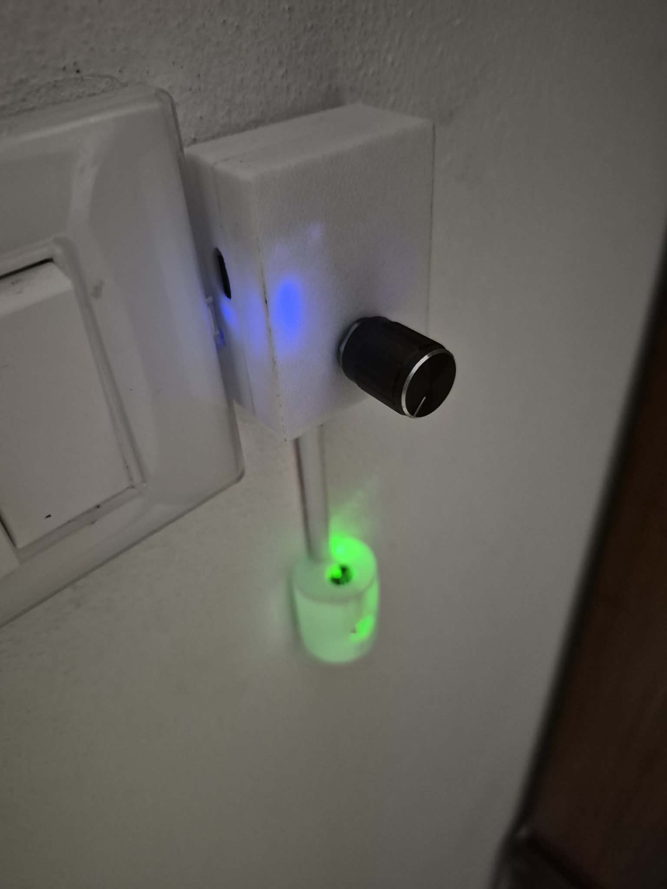
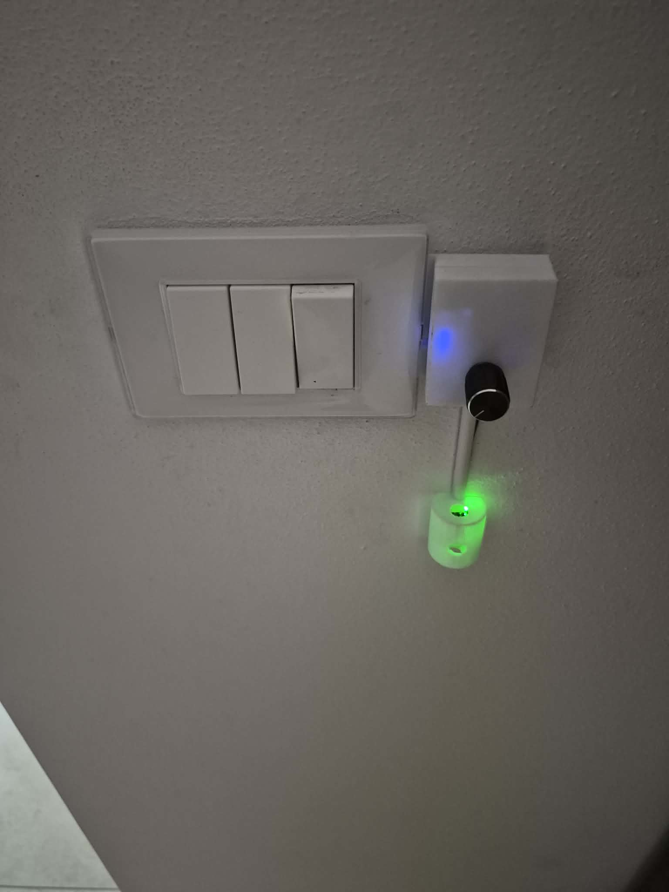
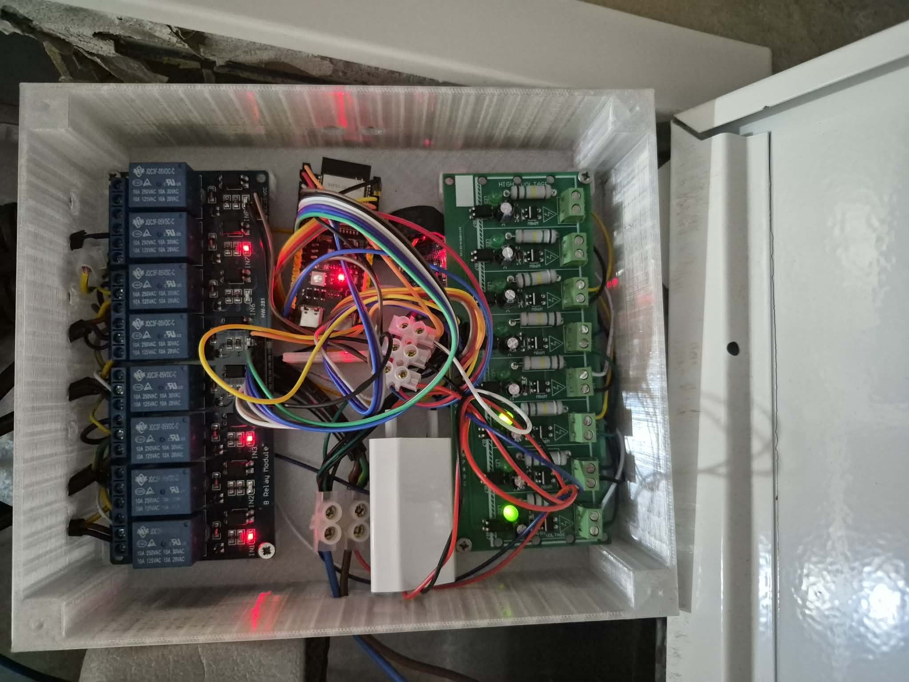
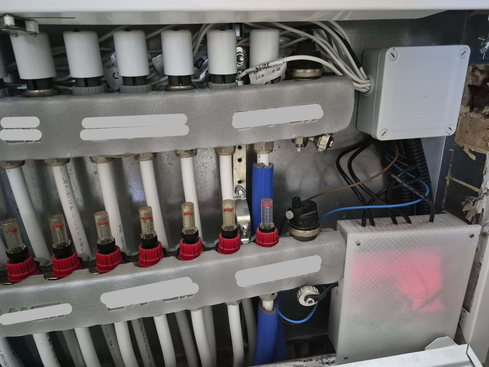

# CLIMAOROen

**Open Source Zonal HVAC Control System**

CLIMAOROen is the English version of CLIMAORO, a complete system for centralized heating and cooling control in buildings with underfloor heating and heat pumps, adaptable to all types of systems.

---

## 🌐 Website

[https://UVAVIVA.github.io/CLIMAOROen/](https://UVAVIVA.github.io/CLIMAOROen/)

**🇮🇹 Versione italiana:** [https://UVAVIVA.github.io/CLIMAORO/](https://UVAVIVA.github.io/CLIMAORO/)

---

## 📖 What is CLIMAORO

CLIMAORO is a system that:

- **Optimizes the heat pump** by reducing short cycling
- **Manages multiple zones** centrally with weight-based logic and thresholds
- **Communicates without WiFi** thanks to ESP-NOW (fallback)
- **Works alongside the traditional system** without replacing it
- **Costs less than €15 per thermostat** (compared to €100-250 for commercial systems)

---

## 📷 Thermostats

  

---

## 🔧 Project Status

| Feature | Status |
|---------|--------|
| Summer cooling | ✅ In production |
| Dehumidifiers | ✅ Integrated |
| Photovoltaics | ✅ Integrated |
| Winter logic | 🔄 Ready, waiting for testing |
| Documentation | 📝 Under construction |

---

## 🎛️ Thermostat with encoder in a 503 box

 

---

## 🧩 Main Components

| Component | Description |
|-----------|-------------|
| **Thermostats** | ESP32 (S3/C6/C3) devices with sensors, LEDs, and various installation modes (plug-in, 503 box) |
| **Manifold** | Central unit with relays for valves and circulator, with opto-isolated feedback |
| **Centralized logic** | Intelligent control that decides when to turn on the pump based on aggregated demand |

---

## 🔌 Mobile thermostat

  

---

## 🤝 LOOKING FOR COLLABORATIONS

This project is open to contributions. I am looking for people with specific skills to help develop and improve the system.

### Areas of interest

| Area | Skills needed |
|------|---------------|
| **Hardware** | PCB design, component optimization, reliability improvement, cost reduction |
| **Programming** | ESPHome firmware, control logic, Home Assistant integration, interface development |
| **Documentation** | Installation guides, technical manuals, translations |
| **Testing** | Testing on other systems, in different contexts, with different configurations |
| **App development** | Application to generate configurations without touching code |

### Who I'm looking for

People who already know how to work in these areas. The project has reached a level of complexity that requires solid experience: contributors must be able to read and modify code, understand electrical schematics, or document clearly and precisely.

It is not necessary to have experience in all areas, but it is important to have **solid skills in at least one of them**.

### How to contribute

1. Explore the project on [GitHub](https://github.com/UVAVIVA/CLIMAOROen)
2. Open an **issue** to discuss changes
3. **Fork** the repository
4. Submit a **pull request**

📌 **Learn more:** [https://UVAVIVA.github.io/CLIMAOROen/](https://UVAVIVA.github.io/CLIMAOROen/)

---

## 🛠️ Manifold

  

---

## 📜 License

MIT License – Copyright (c) 2026 UVAVIVA

---

**Built with passion, from scratch.**